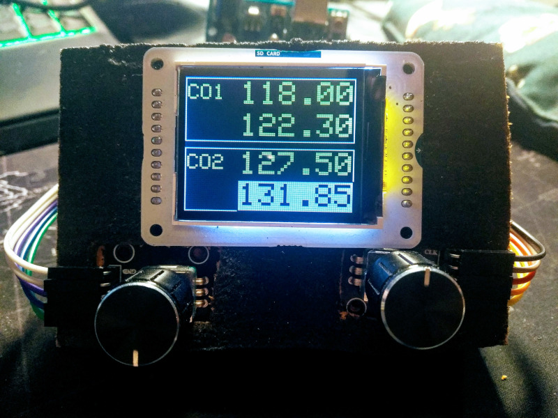

This is a radio and control panel for FlightGear, the open source flight simulator, using an Arduino UNO and a TFT module.



You can control:

- Radio frequencies: COM1, COM2, NAV1, NAV2 (and their standby freqs); ADF (only current); Transponder.
- Dials: Course bug in the HI; radials of the OBS1, OBS2; QNH for the barometer.

# Source code

The Arduino source code is in `radioPanelTFT.ino`. Check the headers for building instructions and pin configuration.
`radioPanel7S.old` is an old version that worked with five 7-segment modules. Provided for reference.

Several themes are available, but you must build the project to select one or the other: white on blue, green on black, orante on black.

`radioModule.py` is a Python driver. You must run this driver in your PC. Windows are Linux are supported. See below.

All the source code and resources are under the GPL.

# Installation

You'll need a driver writen in Python for communications with FlightGear.

In Windows, install Python3 from the Microsoft store. In Linux, Python3 is already installed by default.

Run these commands from bash/powershell:

```
pip3 install -U serial
pip3 install -U telnet
```

You need running these commands only once.

# Running

Run Flightgear with `--telnet 9000`. Once FlightGear is fully loaded, run:

```
python3 radioModule.py --host localhost --port 9000 --serial COM3 --conf c172p.ini
```

Check the serial port for your system. `COM3` and `COM4` are typical serial ports for Arduino in Windows.
`/dev/ttyUSB0` or `/dev/ttyUSB1` are typical in Linux. A configuration file for the C172P aircraft is provided,
but most GA aircraft will be compatible with this configuration file.

The driver reads the current configuration for freqs in FlightGear and loads this configuration in the Arduino panel. Warning: after the initial reading, the panel is one-way only. If you change freqs using any other method (the main FG window, dialogs, Phi...), these changes are not reflected in the Arduino panel.

- Left encoder: change the currently selected item (COM1-STB -> COM2-STB -> NAV1-STB -> OBS1 -> NAV2-STB -> OBS2 -> ADF -> Transponder -> HDG -> BARO). Push: in the items that allow swapping (COM and NAV), swap frequencies.
- Right encoder: change selected value. Push: toggle "small/big step".

